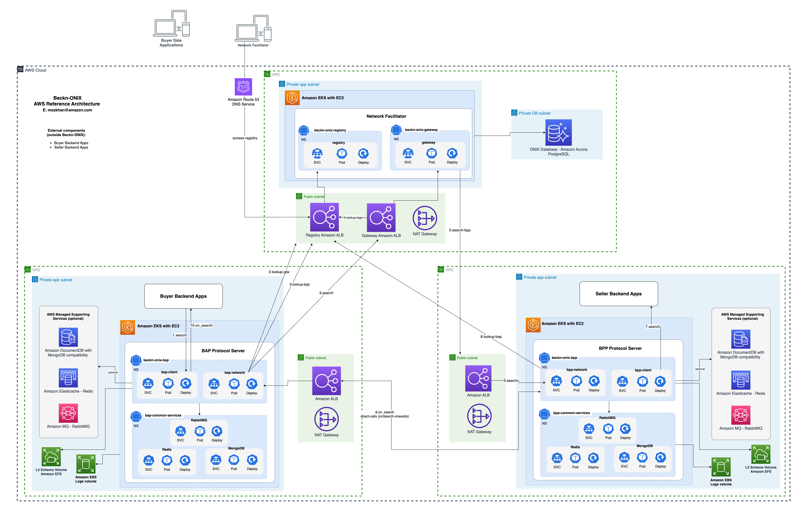

# Beckn-ONIX, one-click deployment on AWS

### Description
Beckn-ONIX is **[FIDE](https://fide.org/)** project aimed at easing setup and maintainance of a **[Beckn](https://becknprotocol.io/)** Network using reference implementations. Objectives include setting up reliable, configurable and fast Beckn network as a virtual appliance. This initiative is independent of the evolution of the Beckn protocol. This effort is also aimed at inviting contributions from the community to create secure, reliable builds for production environments.

> **Info:** Disclaimer : Beckn-onix is a reference implementation of the Beckn-onix stack. It is a reference application only and has not been tested for production environmens. However, implementers can fork this repository and build it for scale. The maintainer of this repository holds no liabillity for deployments of this application in production environments.

### Packaging overview
This packaging initiative provides a robust solution for deploying and managing Beckn-ONIX services on AWS. It is designed to ensure high availability, scalability, and resilience of Beckn-ONIX components like the Gateway, Registry, BAP, and BPP, making them ready for a Kubernetes-based environment. Additionally, it allows users the flexibility to choose managed AWS services, optimizing for production-scale deployments while reducing operational overhead.

The packaging supports a fully automated, one-click deployment solution aligned with the reference architecture, ensuring that each layer of the Beckn-ONIX stack is designed with fault tolerance, load balancing, and scaling in mind. This approach not only simplifies the deployment process but also promotes best practices in infrastructure as code, making it easier to maintain and evolve the platform in a cost-effective manner.

### Beckn-ONIX Deployment
This repository contains the source code and configuration for deploying Beckn-ONIX services stack that leverages the power of Amazon Web Services (AWS) **[Cloud Development Kit (CDK)](https://aws.amazon.com/cdk)** for infrastructure provisioning and **[Helm](https://helm.sh)** for deploying services within an Amazon Elastic Kubernetes Service (EKS) cluster.  

Two mode of deployments, catering to different deployment scenarios.

#### Mode One: AWS CDK + Helm
This mode offers a comprehensive solution for users who prefer a one-click deployment approach to provisioning AWS infrastructure and deploying the Beckn-ONIX services, all in automated fashion.

* [AWS CDK One Click Deployment](documentations/01-Deployment-CDK-Beckn-ONIX.md)

#### Mode Two: Direct Helm Chart Invocation
An alternative deployment approach accommodates users with existing essential AWS infrastructure components like Amazon RDS Postgres and an Amazon EKS cluster. This mode enables the direct installation of the Sunbird RC 2.0 Helm chart without relying on AWS CDK scripts. Alternatively, you can combine both methods, utilizing CDK for provisioning specific services like the EKS cluster.

* [Helm Chart Deployment](documentations/02-Deployment-Helm-Beckn-ONIX.md)

### Beckn-ONIX reference architecture
#### Mendatory AWS services
Required AWS services to deploy and operate the Beckn-ONIX services:
* Amazon VPC
* Amazon RDS for PostgreSQL (registry and gateway)
* Amazon EKS
* Amazon ALB
* Amazon EBS and EFS volumes

#### Optional AWS services - Only for BAP and BPP
* Amazon DocumentDB with MongoDB compatibility 
* Amazon Elasticache - Redis
* Amazon MQ - RabbitMQ

