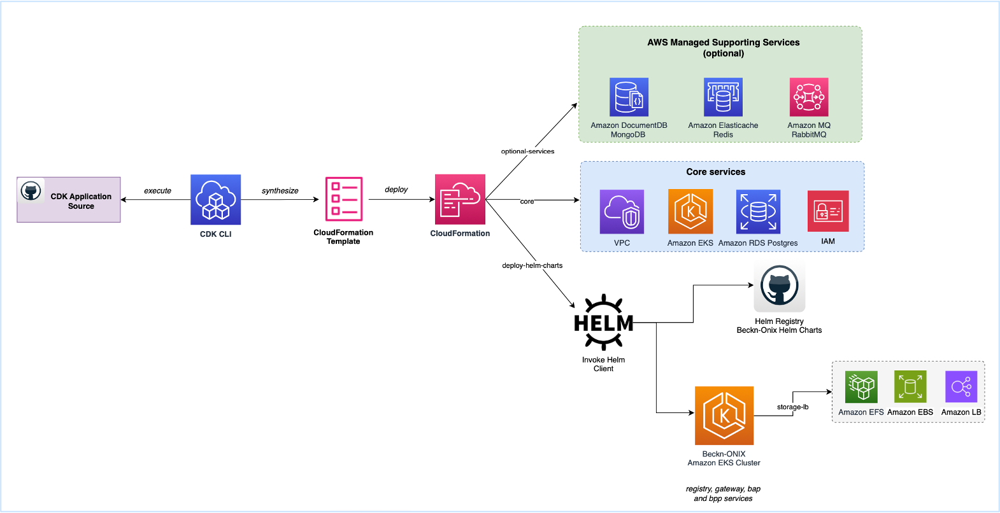

# Beckn-ONIX AWS CDK

This repository contains AWS CDK stacks for deploying the Beckn-ONIX services on AWS using the open-source AWS CDK IaC. The AWS CDK stacks are designed to deploy the following services:

- **Registry**: Manages Beckn service providers and categories, and provides an additional layer of trust on the network by listing platforms that are compliant to a network’s rules and policies.
- **Gateway**: Central point for routing Beckn messages between providers and participants.
- **BAP (Beckn Application Platform)**: A consumer-facing infrastructure which captures consumers’ requests via its UI applications, converts them into beckn-compliant schemas and APIs at the server side, and fires them at the network.
- **BPP (Beckn Provider Platform)**: Other side of the network is the supply side which consists of Beckn Provider Platforms (BPPs) that maintain an active inventory, one or more catalogs of products and services, implement the supply logic and enable fulfillment of orders.




## Prerequisites

- **AWS Account**: An AWS account to deploy AWS CDK stacks
- **[AWS CLI](https://docs.aws.amazon.com/cli/latest/userguide/getting-started-install.html)**: Configured with AWS account
- **Kubectl Client**: Configured with the Amazon EKS cluster. 
- **Public Domain/Sub-Domain**: Along with SSL certificates for HTTPS.

### Domain and Subdomains

Beckn-ONIX requires a public domain to be associated with the following services:

- Registry
- Gateway
- BAP Network
- BPP Network

Users must obtain a public domain and create subdomains for each service. Additionally, an SSL certificate must be issued for each subdomain to enable HTTPS. You can use [AWS Certificate Manager](https://aws.amazon.com/certificate-manager/pricing/), which provides public SSL/TLS certificates at no cost.

## Requesting a Public SSL Certificate through AWS Certificate Manager

Gather the list of subdomains you intend to use for Beckn-ONIX services (as outlined in the pre-requisite).

To obtain an SSL certificate through AWS Certificate Manager, follow the easy steps provided in the official [AWS ACM Documentation](https://docs.aws.amazon.com/acm/latest/userguide/gs-acm-request-public.html).

Once a certificate is issued, copy the certificate ARN to be used in the Helm charts later. The certificate ARN follows this format:

`arn:aws:acm:ap-south-1:<aws-account-id>:certificate/<identifier>`

## Beckn-ONIX CDK Project Overview

The AWS CDK project follows a specific folder structure for better organization:

- **lib/**: This folder contains all the CDK stacks. Each stack represents a set of AWS resources that are deployed together.
- **bin/**: This folder contains the `beckn-cdk.ts` file, which serves as the entry point to the CDK application.
- **config.ts**: Located in the `lib/` folder, this file holds all the necessary environment variables for your stacks.
- **.env**: This file is located in the root of the AWS CDK project and contains user-specific environment variables.

### CDK Stacks Overview

| CDK Stack Name       | Description                                                                                       |
|----------------------|---------------------------------------------------------------------------------------------------|
| VpcStack             | This stack creates the VPC in which your resources will be deployed, along with one public subnet and two private subnets. |
| EksStack             | This stack creates an Amazon EKS (Elastic Kubernetes Service) cluster for deploying Kubernetes applications. |
| RdsStack             | This stack creates a PostgreSQL Aurora database cluster for your application's data storage needs. |
| HelmRegistryStack    | This stack deploys Beckn-Onix Registry helm charts.                                              |
| HelmGatewayStack     | This stack deploys Beckn-Onix Gateway helm charts.                                               |
| HelmBapStack         | This stack deploys Beckn-Onix BAP helm charts.                                                  |
| HelmBppStack         | This stack deploys Beckn-Onix BPP helm charts.                                                  |
| HelmCommonServicesStack | This stack deploys common services (Redis, Mongo, and RabbitMQ) from the open-source Bitnami repository into the Amazon EKS cluster required for BAP and BPP services. |

### Optional Stacks

| CDK Stack Name       | Description                                                                                       |
|----------------------|---------------------------------------------------------------------------------------------------|
| RedisStack           | This stack creates a Redis cluster for caching and data storage needs.                           |
| DocumentDbStack      | This stack creates a DocumentDB cluster for document storage and retrieval.                      |
| RabbitMqStack        | This stack creates a RabbitMQ broker for managing message queues and pub/sub messaging.          |

## AWS CDK Environment Variables

**Note:** Depending on the Beckn-ONIX component you wish to install, please update the `.env` file with the respective environment variables.

#### AWS SPECIFIC MANDATORY VARIABLES ####

| Environment Variables |   Example value | Description |
| --------------------- | --------------  | ----------  |
| `REGION`                | `ap-south-1`      | The AWS region in which to deploy all the resources |
| `ACCOUNT`               | `123456789123`    | Your AWS 12 digit account number |


#### BECKN-ONIX SPECIFIC MANDATORY VARIABLES ####

**Note:** Depending on the Beckn-ONIX component you wish to install, please update the `.env` file with the respective environment variables.

### Registry

| Variable                      | Description                                            | Example Value                                                |
|-------------------------------|--------------------------------------------------------|-------------------------------------------------------------|
| `REGISTRY_EXTERNAL_DOMAIN`               | External domain for the registry                       | `registry-cdk.beckn-onix-aws-cdk.becknprotocol.io`        |
| `CERT_ARN`                   | SSL certificate ARN (AWS Certificate Manager)         | `arn:aws:acm:ap-south-1:365975017663:certificate/04d1ef71-8407-495b-82f0-4eded8694189` |

### Gateway

| Variable                      | Description                                            | Example Value                                                |
|-------------------------------|--------------------------------------------------------|-------------------------------------------------------------|
| `GATEWAY_EXTERNAL_DOMAIN`     | External domain for the gateway                        | `gateway-cdk.beckn-onix-aws-cdk.becknprotocol.io`         |
| `REGISTRY_URL`     | Registry URL                        | `gateway-cdk.beckn-onix-aws-cdk.becknprotocol.io`         |
| `CERT_ARN`                   | SSL certificate ARN (AWS Certificate Manager)         | `arn:aws:acm:ap-south-1:365975017663:certificate/04d1ef71-8407-495b-82f0-4eded8694189` |

### BAP (Beckn Application Platform)

| Variable                      | Description                                            | Example Value                                                |
|-------------------------------|--------------------------------------------------------|-------------------------------------------------------------|
| `BAP_EXTERNAL_DOMAIN`         | External domain for the BAP                           | `bap-cdk.beckn-onix-aws-cdk.becknprotocol.io`             |
| `BAP_PRIVATE_KEY`             | Private key for the BAP                               | `pivurna3jQBmZGZeeOssgvD0NqMUuWedGjnM9U+hf8i5GXy3eoHVP7ZNs0CL+m7WB/Lq7L2/NvdPdiJWt9kjOQ==` |
| `BAP_PUBLIC_KEY`              | Public key for the BAP                               | `uRl8t3qB1T+2TbNAi/pu1gfy6uy9vzb3T3YiVrfZIzk=`          |
| `CERT_ARN`                   | SSL certificate ARN (AWS Certificate Manager)         | `arn:aws:acm:ap-south-1:365975017663:certificate/04d1ef71-8407-495b-82f0-4eded8694189` |

### BPP (Beckn Provider Platform)

| Variable                      | Description                                            | Example Value                                                |
|-------------------------------|--------------------------------------------------------|-------------------------------------------------------------|
| `BPP_EXTERNAL_DOMAIN`         | External domain for the BPP                           | `bpp-cdk.beckn-onix-aws-cdk.becknprotocol.io`             |
| `BPP_PRIVATE_KEY`             | Private key for the BPP                               | `pivurna3jQBmZGZeeOssgvD0NqMUuWedGjnM9U+hf8i5GXy3eoHVP7ZNs0CL+m7WB/Lq7L2/NvdPdiJWt9kjOQ==` |
| `BPP_PUBLIC_KEY`              | Public key for the BPP                               | `uRl8t3qB1T+2TbNAi/pu1gfy6uy9vzb3T3YiVrfZIzk=`          |
| `CERT_ARN`                   | SSL certificate ARN (AWS Certificate Manager)         | `arn:aws:acm:ap-south-1:365975017663:certificate/04d1ef71-8407-495b-82f0-4eded8694189` |
                                                        
## Prepare your environment

```bash
# Install TypeScript globally for CDK
npm i -g typescript

# Install aws cdk
npm i -g aws-cdk

# Clone the repository 
git clone https://github.com/beckn/beckn-onix.git
cd aws-cdk/beckn-cdk

# Install the CDK application
npm i

# cdk bootstrap [aws://<ACCOUNT-NUMBER>/<REGION>]
cdk bootstrap aws://<ACCOUNT-NUMBER>/<REGION>
```

## Deploy CDK

After you have prepared the environment, made the relevant updates to the `.env` file as per the Beckn-ONIX component you're deploying, run the following commands to begin the deployment process.

### Deployment by Environment

You can now choose to deploy one of the following environments:

1. **Registry Environment**
This will deploy the following stacks: VPC, Amazon EKS, and Amazon RDS Aurora Postgres and Registry:

```bash
cdk list --context env=registry --all
cdk deploy --context env=registry --all
```

2. **Gateway Environment**
This will deploy the following stacks: VPC, Amazon EKS, Amazon RDS Aurora Postgres and Gateway:

```bash
cdk list --context env=gateway --all
cdk deploy --context env=gateway --all
```

### Generate SSL Key Pair required for BAP and BPP

The Protocol Server (BAP/BPP) provides a key generation script.

**Note:** Ensure Node.js is installed on your system.

```bash
curl https://raw.githubusercontent.com/beckn/protocol-server/master/scripts/generate-keys.js > generate-keys.js
npm install libsodium-wrappers
node generate-keys.js
```

**Note:** Copy the `publicKey` and `privateKey` from the output. You need to add keys to .env file before running CDK deploy.

3. **BAP (Buyer Application Provider) Environment**
This will deploy the following stacks: VPC, Amazon EKS, BAP, and common services in Amazon EKS - Redis, DocumentDB, and RabbitMQ:

```bash
cdk list --context env=bap --all
cdk deploy --context env=bap --all
```

4. **BPP (Buyer Platform Provider) Environment**
This will deploy the following stacks: VPC, Amazon EKS, BAP, and common services in Amazon EKS - Redis, DocumentDB, and RabbitMQ:

```bash
cdk list --context env=bpp -all
cdk deploy --context env=bpp -all
```

5. **Sandbox Environment**  
This environment is suitable for non-prod setup and will deploy all the stacks including - VPC, Amazon EKS, Amazon RDS Aurora Postgres, all Beckn-Onix services including common services:

```bash
cdk list --context env=sandbox --all
cdk deploy --context env=sandbox --all
```

## Destroy CDK Resources

If you wish to clean up and remove all the deployed resources, you can use the following command:

```bash
cdk destroy --context env=<environment> --all

Replace <environment> with the environment you wish to destroy (e.g., registry, gateway, bap, bpp, or sandbox). This command will prompt you to confirm the deletion of all resources in the specified stack.


## Next Steps

After installing all Beckn-Onix services, proceed with the next steps to verify and complete the setup:

1. **[Verify Deployments](documentations/verify-deployments.md)**

   To ensure that your Beckn-Onix services are running correctly, follow the instructions in the [Verify Deployments](documentations/verify-deployments.md) document. This will help you confirm that the services are operational and identify any issues that need to be addressed.

2. **[Update DNS Records](documentations/post-deployment-dns-config.md)**

   To configure DNS settings for your services, follow the instructions provided in the [Post-Deployment DNS Configuration](documentations/post-deployment-dns-config.md) document. This will guide you through retrieving the necessary Load Balancer addresses and updating your DNS records.

3. **[Register BAP and BPP with Registry](documentations/post-deployment-bap-bpp-register.md)**

   After updating your DNS records, you need to register your participants BAP and BPP network with the registry service. Follow the steps in the [BAP and BPP Registration](documentations/post-deployment-bap-bpp-register.md) document to complete this process.


