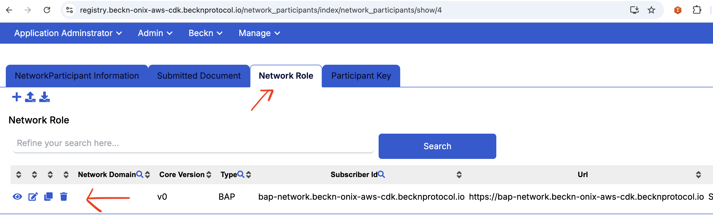
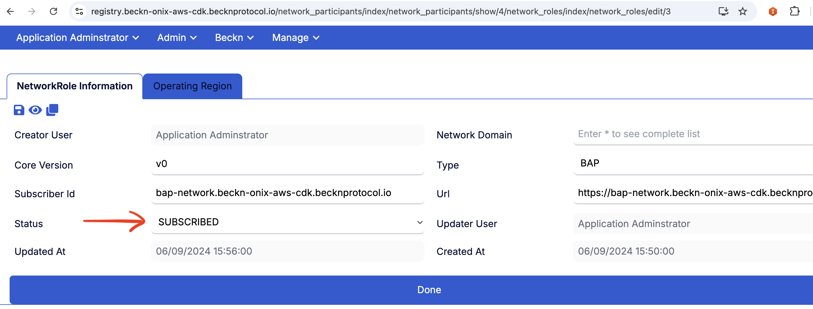

# BAP and BPP registration with Registry

After updating your DNS records, you need to register the `bap-network` and `bpp-network` services with the registry service. Follow these instructions to complete the registration process:

## 1. Register BAP or BPP Network

### Formulate the Registration Payload

Use the table below to create the JSON payload for registering the `bap-network` or `bpp-network`:

| Field                | Description                                                   | Example Value                                               |
|----------------------|---------------------------------------------------------------|-------------------------------------------------------------|
| `subscriber_id`      | Set this to the DNS name of the `bap-network` or `bpp-network`. | `bap-network.beckn-onix-aws-cdk.becknprotocol.io` or `bpp-network.beckn-onix-aws-cdk.becknprotocol.io` |
| `pub_key_id`         | Public key that the BAP/BPP service started with.            |             |
| `unique_key_id`      | Unique key identifier, usually in the format `subscriber_id.k1`. | `bap-network.beckn-onix-aws-cdk.becknprotocol.io.k1` or `bpp-network.beckn-onix-aws-cdk.becknprotocol.io.k1` |
| `subscriber_url`     | URL of the `bap-network` or `bpp-network`.                    | `https://bap-network.beckn-onix-aws-cdk.becknprotocol.io` or `https://bpp-network.beckn-onix-aws-cdk.becknprotocol.io` |
| `domain`             | Leave this as an empty string if not used. Or check if a domain has been configured on Registry.                    | ` `                                                         |
| `extended_attributes`| Additional attributes if any.                                 | `{"domains": []}`                                          |
| `encr_public_key`    | Encryption public key that the BAP/BPP service uses. This is same as `pub_key_id`          |             |
| `signing_public_key` | Signing public key that the BAP/BPP service uses. This is same as `pub_key_id`            |             |
| `valid_from`         | Start date and time in ISO 8601 format.                       | `2024-09-05T09:27:57.630Z`                                 |
| `valid_until`        | Expiration date and time in ISO 8601 format.                  | `2027-09-06T09:28:40.494Z`                                 |
| `type`               | Set to `BAP` or `BPP` based on the service.                    | `BAP` or `BPP`                                             |
| `country`            | Country code.                                                 | `IND`                                                       |
| `status`             | Use `SUBSCRIBED` to indicate that the registration is complete. | `SUBSCRIBED`                                               |

**Example `curl` Command for BAP Network:**

```bash
curl --location --request POST 'https://registry.beckn-onix-aws-cdk.becknprotocol.io/subscribers/register' \
--header "Content-Type: application/json" \
--data-raw '{
    "subscriber_id": "subscriber_id",
    "pub_key_id": "public_key",
    "unique_key_id": "subscriber_id.k1",
    "subscriber_url": "https://url_bap_network",
    "domain": " ",
    "extended_attributes": {"domains": []},
    "encr_public_key": "public_key",
    "signing_public_key": "public_key",
    "valid_from": "2024-09-05T09:27:57.630Z",
    "valid_until": "2027-09-06T09:28:40.494Z",
    "type": "BAP",
    "country": "IND",
    "status": "SUBSCRIBED"
}'
```

**Example `curl` Command for BPP Network:**

```bash
curl --location --request POST 'https://registry.beckn-onix-aws-cdk.becknprotocol.io/subscribers/register' \
--header "Content-Type: application/json" \
--data-raw '{
    "subscriber_id": "subscriber_id",
    "pub_key_id": "public_key",
    "unique_key_id": "subscriber_id.k1",
    "subscriber_url": "https://url-bpp-network",
    "domain": " ",
    "extended_attributes": {"domains": []},
    "encr_public_key": "public_key",
    "signing_public_key": "public_key",
    "valid_from": "2024-09-05T09:27:57.630Z",
    "valid_until": "2027-09-06T09:28:40.494Z",
    "type": "BPP",
    "country": "IND",
    "status": "SUBSCRIBED"
}'
```

### Update Status in Registry UI

After sending the registration request, you need to manually update the status in the registry service UI. The auto-registration feature of BAP and BPP with Registry is in the backlog. Follow these steps:

1. **Login into the Registry**

   Navigate to the **Admin** section, and click on **Network Participant**.

   

2. **Open BAP or BPP Participant**

   Find and select the **BAP** or **BPP** participant you registered earlier.

   

3. **Navigate to Network Role Tab and Edit**

   Go to the **Network Role** tab and click **Edit**.

   

4. **Edit Status and Select SUBSCRIBE**

   Update the status from `INITIATED` to `SUBSCRIBED`, then save your changes.

   


