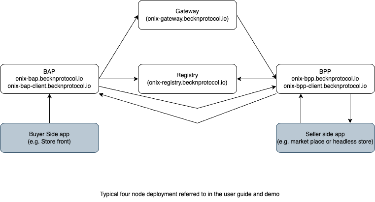
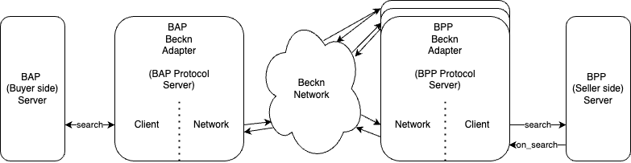

# Beckn-ONIX - User Guide

## Table of Contents

- [Introduction](#introduction)
- [Running Beckn-ONIX on the cloud](#running-beckn-onix-on-the-cloud)
  - [Sample deployment diagram](#sample-deployment-diagram)
  - [Overall Prerequisites](#overall-pre-requisites)
  - [Setting up a new network - Registry](#setting-up-a-new-network---registry)
  - [Setting up a Gateway](#setting-up-a-gateway)
  - [Setting up a BAP Beckn Adapter](#setting-up-a-bap-beckn-adapter)
  - [Setting up a BPP Beckn Adapter](#setting-up-a-bpp-beckn-adapter)
  - [Downloading Layer 2 Configuration for a domain](#downloading-layer-2-configuration-for-a-domain)
  - [Testing transactions on the network](#testing-transactions-on-the-new-network)
  - [Connecting BAP Beckn Adapter to BAP Software](#connecting-bap-beckn-adapter-to-bapbuyer-side-software)
  - [Connecting BPP Beckn Adapter to BPP Software](#connecting-bpp-beckn-adapter-to-bppseller-side-software)
- [Running Beckn-ONIX locally](#running-beckn-onix-locally)
- [Appendix A - subdomain/domain name configuration](#appendix-a---registering-or-adding-domain-or-subdomains)
- [Appendix B - Nginx reverse proxy configuration](#appendix-b---nginx-reverse-proxy-configuration)

## Introduction

Beckn-ONIX is [FIDE](https://fide.org/) project aimed at easing setup and maintainance of a [Beckn](https://becknprotocol.io/) Network using reference implementations. Objectives include setting up reliable, configurable and fast Beckn network as a virtual appliance. This initiative is independent of the evolution of the Beckn protocol. This effort is also aimed at inviting contributions from the community to create secure, reliable builds for production environments.

This user guide provides all information necessary to setup a Beckn network and conduct transactions on it. For a better understanding of Beckn and the terminologies associated with the ecosystem, please refer to the [Beckn for Developers site](https://developers.becknprotocol.io/).

There are two primary setups covered in this document.

- A typical production setup with the various Beckn components on different nodes - This is explained in the Running Beckn-ONIX on the cloud section.
- A developer all in one setup - This is explained in the Running Beckn-ONIX locally section.

## Running Beckn-ONIX on the Cloud

Using Beckn-ONIX, we can install a Beckn network on the cloud. This will be similar to a simple production instance of Beckn network. In the sections below, we use Amazon EC2 as an example for VPS provider. The guide can be useful for other cloud environments with simple changes on methods of accessing them etc. In this part of the guide, we explain installation of the four components of Registry, Gateway, BAP and BPP Beckn Adapter on different instances of virtual servers. You can however use the same process with minimal changes to install multiple nodes on the same virtual server (e.g. Registry and Gateway on a single virtual server)

### Sample deployment diagram

The following diagram shows a conceptual view of a multi-node Beckn network. The urls shown here are the same as those used in the examples.



**Use of docker and reference implementations**
Docker compose and docker are extensively used in the installation and running of the various component software. Similarly the Beckn-ONIX installer, itself being a reference implementation, installs the reference implentation of the Beckn Adapter for the BAP and BPP, reference implementation of the registry and gateway. In order to interact with the internals of these components, we will need to enter the container. Familiarity with Docker will be useful in working with the installation. To list the running containers use `docker ps`. Similarly for example to connect to a container and browse it using shell, use `docker exec -it bap-client sh`

### Overall Pre-requisites

- Atleast four virtual servers (EC2 instances) configured on the cloud provider with administrator login (e.g. ssh access) to them.
- Access to domain name management with ability to create domain-name/subdomains for each of the components.
- Run the following two commands on all machines where the script is being run for the first time. Login to a new shell for the command to take effect and continue with the installation. Not doing so will result in docker permisssion error

```
sudo groupadd docker
sudo usermod -aG docker $USER
```

- Each of the various sections below list additional pre-requisites which build on these.

### Setting up a new network - Registry

In the Beckn ecosystem, a new network starts with the setting up of the Registry. All network participant register with the Registry with their public key. They also call the lookup endpoint on the Registry to discover and validate other network participants.

**Prerequisites for installation**

- A domain or subdomain where the registry will be accessible (e.g https://onix-registry.becknprotocol.io)
- A virtual server with the above mentioned domain/subdomain pointing to it. Refer [Appendix A](#appendix-a---registering-or-adding-domain-or-subdomains) for details
- SSL certificate for the server and configured in Nginx. Refer [Appendix B](#ssl-certificates-configured-in-reverse-proxy)
- Reverse proxy configured to route the traffic at the registry url (e.g. https://onix-registry.becknprotocol.io) to port 3030. Refer [Appendix B](#configuring-nginx-reverse-proxy-using-proxy-pass)

**Installation Steps**

- Clone the Beckn-ONIX repository `git clone https://github.com/beckn/beckn-onix.git`
- Change into the installation folder `cd beckn-onix/install`
- Run the installation script `./beckn-onix.sh`
- Specify you want to start a new network and install the registry
- Enter the publicly accessible address of the registry (e.g. https://onix-registry.becknprotocol.io)
- The registry installation will continue to completion.

### Setting up a Gateway

In the Beckn ecosystem, the role of the Gateway is limited to the discovery phase. When the BAP wants to search for an item, it sends it to the Gateway and the Gateway broadcasts the request to all BPPs registered for the domain. It registers itself with the registry upon installation.

**Prerequisites**

- Address of the registry of the network the gateway will join (e.g. https://onix-registry.becknprotocol.io)
- A domain or subdomain where the gateway will be accessible (e.g https://onix-gateway.becknprotocol.io)
- A virtual server with the above mentioned domain/subdomain pointing to it. Refer [Appendix A](#appendix-a---registering-or-adding-domain-or-subdomains) for details
- SSL certificate for the server and configured in Nginx. Refer [Appendix B](#ssl-certificates-configured-in-reverse-proxy)
- Reverse proxy configured to route the traffic at the gateway url (e.g. https://onix-gateway.becknprotocol.io) to port 4030. Refer [Appendix B](#configuring-nginx-reverse-proxy-using-proxy-pass)

**Installation Steps**

- Clone the Beckn-ONIX repository (git clone https://github.com/beckn/beckn-onix.git)
- Change into the installation folder `cd beckn-onix/install`
- Run the installation script `./beckn-onix.sh`
- Specify you want to join an existing network and install the gateway
- Enter the address of the registry of the network you want to join (e.g. https://onix-registry.becknprotocol.io)
- Enter the publicly accessible address of the gateway (e.g. https://onix-gateway.becknprotocol.io)
- The gateway installation will continue to completion and it will register itself with the registry as a participant with role BG(Beckn Gateway)

### Setting up a BAP Beckn Adapter

The BAP (Beckn Application Platform) is the bridge between buyer side applications and the Beckn Network. As part of Beckn-ONIX installation, a reference implementation of the Beckn Adapter for the BAP is installed. This adapter talks to two logical entities. On the one side you have the buyer applications which call the BAP with Beckn requests. The BAP forwards these requests to the Beckn network and other participants call back the BAP with responses. These two endpoints are referred to as client and network endpoints in this document.

**Prerequisites**

- Address of the registry's subscription endpoint of the network the BAP will join (e.g. https://onix-registry.becknprotocol.io/subscribers)
- A domain or subdomain where the client endpoint of BAP will be accessible (e.g https://onix-bap-client.becknprotocol.io)
- A domain or subdomain where the network endpoint of BAP will be accessible (e.g. https://onix-bap.becknprtocol.io)
- A virtual server with both the above mentioned domains/subdomains pointing to it. Refer [Appendix A](#appendix-a---registering-or-adding-domain-or-subdomains) for details
- SSL certificate for the two endpoints and configured in Nginx. Refer [Appendix B](#ssl-certificates-configured-in-reverse-proxy)
- Reverse proxy configured to route the traffic at the bap client url (e.g. https://onix-bap-client.becknprotocol.io) to port 5001. Refer [Appendix B](#configuring-nginx-reverse-proxy-using-proxy-pass)
- Reverse proxy configured to route the traffic at the bap network url (e.g. https://onix-bap.becknprotocol.io) to port 5002. Refer [Appendix B](#configuring-nginx-reverse-proxy-using-proxy-pass)

**Installation Steps**

- Clone the Beckn-ONIX repository (git clone https://github.com/beckn/beckn-onix.git)
- Change into the installation folder `cd beckn-onix/install`
- Run the installation script `./beckn-onix.sh`
- Specify you want to join an existing network and install the BAP.
- Enter the Subscriber id for the BAP. When setting up a new network, its value can be anything you want. However it is recommended to have it the same as the BAP URL without the https:// part (e.g. onix-bap.becknprotocol.io). In existing networks this might be further validated for uniqueness by the registry.
- Enter the Subscriber URI for the BAP. This is the network endpoint of the BAP Beckn Adapter. (e.g. https://onix-bap.becknprotocol.io)
- Enter the address of the subscription endpoint of the registry of the network you want to join (e.g. https://onix-registry.becknprotocol.io/subscribers). Note the suffix subscribers in the endpoint address.
- The BAP installation will continue to completion and it will register itself with the registry as a network participant.

### Setting up a BPP Beckn Adapter

The BPP (Beckn Provider Platform) is the bridge between the seller side applications such as a market place or a headless shop and the Beckn network. As part of Beckn-ONIX installation, a reference implementation of the Beckn Adapter for the BPP is installed. This adapter talks to two entities. On the one side, it talks to the seller side apps. It forwards the requests from the Beckn network to this/these software. It also recieves the responses from the seller side apps. This interface towards the seller side applications is called as BPP-Client (client within the context of BPP)within this document. The BPP adapter also receives requests from the Beckn network and returns back the responses to the requesting participant. This part of the Beckn Adapter is called the BPP Network (or just network when the BPP context is implied.)

**Prerequisites**

- Address of the registry's subscription endpoint of the network the BPP will join (e.g. https://onix-registry.becknprotocol.io/subscribers)
- A domain or subdomain where the client endpoint of BPP will be accessible (e.g https://onix-bpp-client.becknprotocol.io)
- A domain or subdomain where the network endpoint of BPP will be accessible (e.g. https://onix-bpp.becknprtocol.io)
- A virtual server with both the above mentioned domains/subdomains pointing to it. Refer [Appendix A](#appendix-a---registering-or-adding-domain-or-subdomains) for details
- SSL certificate for the two endpoints and configured in Nginx. Refer [Appendix B](#ssl-certificates-configured-in-reverse-proxy)
- Reverse proxy configured to route the traffic at the bap client url (e.g. https://onix-bpp-client.becknprotocol.io) to port 6001. Refer [Appendix B](#configuring-nginx-reverse-proxy-using-proxy-pass)
- Reverse proxy configured to route the traffic at the bap network url (e.g. https://onix-bpp.becknprotocol.io) to port 6002. Refer [Appendix B](#configuring-nginx-reverse-proxy-using-proxy-pass)

**Installation Steps**

- Clone the Beckn-ONIX repository (git clone https://github.com/beckn/beckn-onix.git)
- Change into the installation folder `cd beckn-onix/install`
- Run the installation script `./beckn-onix.sh`
- Specify you want to join an existing network and install the BPP.
- Enter the Subscriber id for the BPP. When setting up a new network, its value can be anything you want. However it is recommended to have it the same as the BPP URL without the https:// part (e.g. onix-bpp.becknprotocol.io). In existing networks this might be further validated for uniqueness by the registry.
- Enter the Subscriber URL for the BPP (e.g. https://onix-bpp.becknprotocol.io). This is the network endpoint of the BPP Beckn Adapter.
- Enter the webhook URL. This is the endpoint on your custom market place or headless shop which will receive Beckn requests. The endpoint usually contains the address of the market place or shop as a substring. (e.g. https://unified-bpp.becknprotocol.io/beckn-bpp-adapter)
- Enter the address of the subscription endpoint of the registry of the network you want to join (e.g. https://onix-registry.becknprotocol.io/subscribers). Note the suffix subscribers in the endpoint address.
- The BPP installation will continue to completion and it will register itself with the registry as a network participant.

### Changing subscription status of BAP and BPP at the registry

While the Beckn-ONIX installs network participant beckn adapter as well as registers them with the Registry, they need to be manually put to the 'Subscribed' status. Its only then that they can transact. In real networks, the network facilitator might require additional documentation or validation before transitioning the BAP/BPP to the Subscribed state. When we are setting up the entire network ourselves, we do this task ourselves.

**Steps**

- Log into your registry at the url you specified (e.g. https://onix-registry.becknprotocol.io). The default username, password is root/root
- Select Network Participants Under Admin menu
- Edit the BAP record. In the Network Role tab, edit the entry and change the state to 'Subscribed'
- Repeat the same for the BPP record.

### Downloading Layer 2 Configuration for a domain

With Beckn network setup by Beckn-ONIX, we have a core network with all required network participants. However we cannot still do any transactions on this network. In order to do transactions, we need the Layer 2 Config file for the domain in which we want to transact. Layer 2 configuration files contain

- rules and policies agreed upon by entities operating in the domain through working group and other consultations
- rules and policies required by the network facilitator

Currently the layer-2 config are per domain, though this might change with future evolution of the Beckn core specification. The layer 2 config file is usually hosted by the network facilitator. Participants have to get this from the hosted location and install it within the respective containers. This is currently done by a script that needs to be run and provided with address of the layer 2 config file.

**Steps**

- Change into the beckn-onix/layer2 folder.
- Start the `download_layer_2_config_bap.sh`
- Specify the path of the layer 2 config file for the required domain. (e.g. https://raw.githubusercontent.com/beckn/beckn-onix/main/layer2/samples/retail_1.1.0.yaml). Some sample layer 2 config files are present at `https://raw.githubusercontent.com/beckn/beckn-onix/main/layer2/samples`
- This file is downloaded and installed into the container.
- Repeat the same process for the BPP. However run the `download_layer_2_config_bpp.sh` file instead.

### Testing transactions on the new network

- We can use postman collection for the specific domain to test end to end communication on the domain. Some sample postman collections for testing are [present here](https://github.com/beckn/beckn-sandbox/tree/main/artefacts)
- When running postman collection from the buyer side, the base url to which the requests are sent should be the client side endpoint of the BAP Beckn Adapter instance. (e.g https://onix-bap-client.becknprotocol.io)

### Connecting BAP Beckn Adapter to BAP(buyer side) software

Currently Beckn ONIX only installs the reference BAP Adapter on the BAP machine. It does not install any reference buyer side software. However in real-world, buyer side BAP software will interact with this BAP Adapter to perform Beckn transactions. This section provides guidance on how to integrate the two. The following diagram shows the message flow from BAP all the way through to the BPP and back.



The BAP software will typically be a Backend server that provides buying side functionality to users. It takes care of functionalities such as user authentication, profile management, Order flow, Order history and other functionalities common in a commerce application. Many of these functionalities are outside of Beckn scope. The Order flow is primarily where the software will use the BAP Beckn Adapter to communicate to the Beckn network. Typically the order flow within Beckn has four stages (Discovery, Order, Fulfillment and Post Fulfillment). Please refer to this [document](https://developers.becknprotocol.io/docs/introduction/beckn-protocol-specification/) for details on how the individual Beckn requests (currently ten) map to these.

Taking an example of a user searching for an item, the user will typically enter his search request (say Arabica Coffee Powder) into the UI which will be conveyed to the BAP Backend server. The BAP backend server will call the BAP-Client endpoint with a Search request. This endpoint in the running example will be https://onix-bap-client.becknprotocol.io/search This endpoint as mentioned in the [Setting up a BAP Beckn Adapter](#setting-up-a-bap-beckn-adapter) should be configured to point to the BAP Beckn Adapter Client softare running at a port (default 5001) through Nginx configuration. The format of the message to be sent is explained in the [core specification](https://github.com/beckn/protocol-specifications/blob/master/api/transaction/build/transaction.yaml). An example is below

```
{
    "context": {
        "domain": "retail",
        "location": {
            "country": {
                "code": "IND"
            },
            "city": {
                "code": "std:080"
            }
        },
        "action": "search",
        "version": "1.1.0",
        "bap_id": "onix-bap.becknprotocol.io",
        "bap_uri": "https://onix-bap.becknprotocol.io",
        "transaction_id": "{{$randomUUID}}",
        "message_id": "{{$randomUUID}}",
        "timestamp": "{{$timestamp}}"
    },
    "message": {
        "intent": {
            "item": {
                "descriptor": {
                    "name": "Arabica Coffee Powder"
                }
            }
        }
    }
}
```

The reference implentation of the BAP Beckn Adapter will forward this to the Beckn network and return back with matching search results from different providers for the retail domain in the network. By default this happens in a synchronous manner, though it can be configured in the BAP Beckn Adapter Client Configuration (Refer to the "Protocol Server BAP Client Setup section" of this [document](https://github.com/beckn/protocol-server/blob/master/setup.md#protocol-server-bap-client-setup)) Refer to the [core protocol specification](https://github.com/beckn/protocol-specifications/blob/master/api/transaction/build/transaction.yaml) for the various other request and response formats for the rest of the order flow requests.

### Connecting BPP Beckn Adapter to BPP(Seller side) software

Currently Beckn-ONIX only installs the BPP Beckn Adapter reference implementation on the BPP machine. It does not install a reference implemenation of a market-place or BPP. Typically in real-world there is a backend server that provides seller functionality that talks to the BPP Beckn Adapter. This section describes how the interaction between BPP Beckn Adapter and such a server should occur. Refer to the image in the previous [section](#connecting-bap-beckn-adapter-to-bapbuyer-side-software) for an illustration of BAP and BPP integration along with message flow.

The BPP software or market-place typically provides functionalities such as Login for shop owners, ability to manage inventory, list products, add product details, take an order, mark fulfillment of orders and aggregate post fulfillment feedback etc. While many of these functionalities are outside of the Beckn protocol, the BPP software will interact with the BPP Beckn Adapter for the order flow. The order flow typically involves Discovery, Order, Fulfillment and Post fulfillment phases and is explained in the context of Beckn [here](https://developers.becknprotocol.io/docs/introduction/beckn-protocol-specification/). The [core protocol specification](https://github.com/beckn/protocol-specifications/blob/master/api/transaction/build/transaction.yaml) explains the format of the various (currently ten) messages that need to flow between the BAP and BPP during the transaction.

The communication between the BPP Beckn Adapter and the BPP software is asynchronous by default. [This document](https://github.com/beckn/protocol-specifications/blob/master/docs/BECKN-003-Beckn-Protocol-Communication-Draft-01.md) explains how the communication happens. In order to connect any BPP software with the BPP Beckn Adapter, we need to do two things.

1. Configure the webhook address on the BPP Beckn Adapter to a endpoint in the BPP software. This endpoint will receive all the Beckn messages. The BPP software should identify the message through the action attribute in the context field of the request. Refer to the [Protocol Server BPP Client Setup](https://github.com/beckn/protocol-server/blob/master/setup.md#protocol-server-bpp-client-setup) section - webhook configuration for details.
2. Once the BPP software is ready with a response (say the item results for the search query), it has to call the BPP Beckn Adapter Client endpoint. In the example, that would be https://onix-bpp-client.becknprotocol.io.

Refer to the [core specification](https://github.com/beckn/protocol-specifications/blob/master/api/transaction/build/transaction.yaml) for details on the format of other responses (on_search, on_select, on_init etc) to complete the order flow.

## Running Beckn-ONIX locally

- In order for people new to Beckn who want to try out Beckn on their own machine, choose the option to "Set up a network on your local machine" in the main screen. The all in one installation has preconfigured values for variables and so pretty much does not ask for any input.

## Appendix A - Registering or adding domain or subdomains

All the components of Beckn network need to be publicly accessible. Using domain names for them is the easiest. There are two options for domain names. One is a separate domain name for each component(e.g. registrybp.io). Second is to use subdomains for the individual componetns (e.g. onix-registry.becknprotocol.io , onix-gateway.becknprotocol.io etc). Which one of these two to use depends on the business requirement. For example if an organization is the network facilitator, they might go for a domain name for the registry instead of subdomain. In the examples given above we have primarily used subdomain approach.

The process of registering domain names differs by the Domain Registrar. An example is here https://www.cloudflare.com/en-gb/products/registrar/

Similarly the process of adding subdomains differs by the Domain Registrar. An example is here https://developers.cloudflare.com/dns/manage-dns-records/how-to/create-subdomain/

For example in the prerequesites when it says "Subdomain name added(e.g. onix-gateway.becknprotocol.io) and point to this virtual server", what needs to be done is

- Decide on a name (here it is onix-gateway)
- Add the name as subdomain at your registrar (here the registrar would be that of becknnprotocol.io)
- Point the record at the registrar to the machine on which you are installing the gateway

## Appendix B - NGINX reverse proxy configuration

All components of Beckn network need to be publicly accessible. Also it is required that they run on the https server for additional security. In addition some of the components of the reference implementation have two webservers running on the same node and require to be each publicly accessible through https. In order to achieve all of these requirements, it is recommended to install reverse-proxy on all the machines where the Beckn network components installed. This document uses Nginx as Reverse proxy, but the same can be configured through other programs.

### SSL certificates configured in reverse proxy

To enable https communication, SSL certificates need to be obtained and configured in Nginx. Depending on where you get the SSL certificate from, the process will vary. One such process for a provider [letsencrypt is documented here](https://letsencrypt.org/getting-started/)

Once the SSL certificate is obtained, it needs to be configured. For Nginx, this [configuration is explained here] (https://nginx.org/en/docs/http/configuring_https_servers.html)

When the prerequisite in this document says: "Nginx is configured with ssl certificate for the registry URL(e.g. https://onix-registry.becknprotocol.io)", it involves the following:

- Obtain ssl certificate for `https://onix-registry.becknprotocol.io`
- Configure Nginx on the virtual server to create a server at https://onix-registry.becknprotocol.io.
- Configure this server to use the ssl certificate

### Configuring Nginx reverse proxy using proxy pass

In the role of reverse proxy, Nginx will forward communication that came on a particular url to a different destination (usually a server running on the same machine at a different port). This facility is used extensively in the reference Beckn components. For example the reference implementation of the BAP Protocol Server installs two servers. One at port 5001 and another at port 5002. We will need to configure two URLs (e.g. https://onix-bap-client.becknprotocol.io and https://onix-bap.becknprotocol.io) for this virtual server and Nginx should forward the first to server running on port 5001 and second to server running on port 5002.

[This document](https://docs.nginx.com/nginx/admin-guide/web-server/reverse-proxy/) explains the configuration of reverse proxy using proxy_pass

You can find sample Nginx configuration for the Registry, Gateway, BAP and BPP [here](./sample_nginx_configurations.md)
